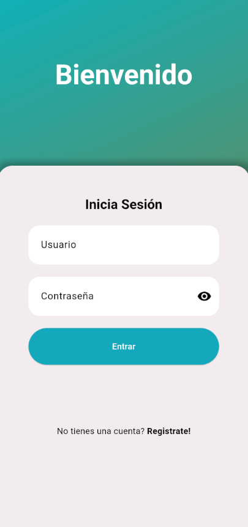
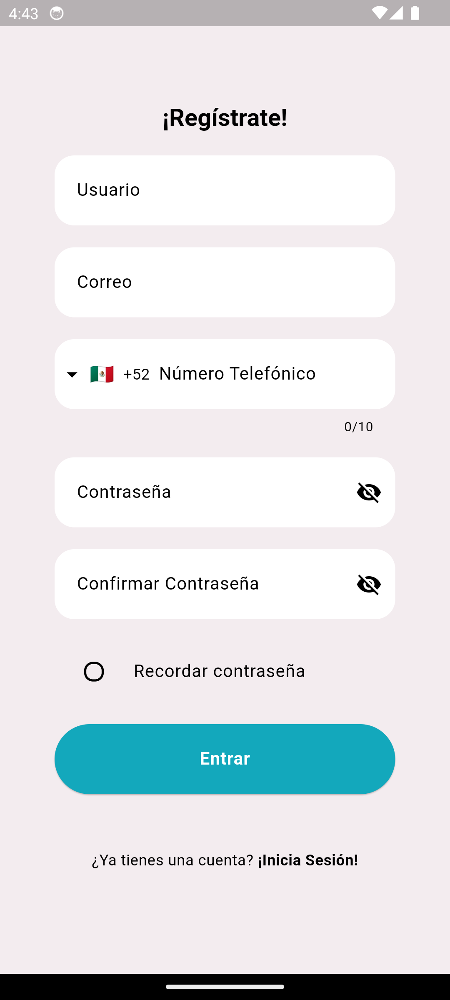
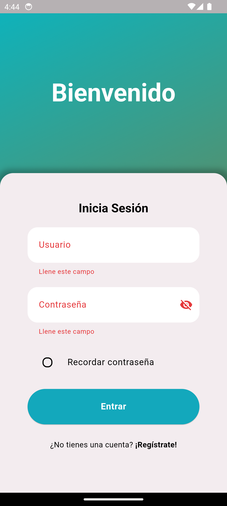
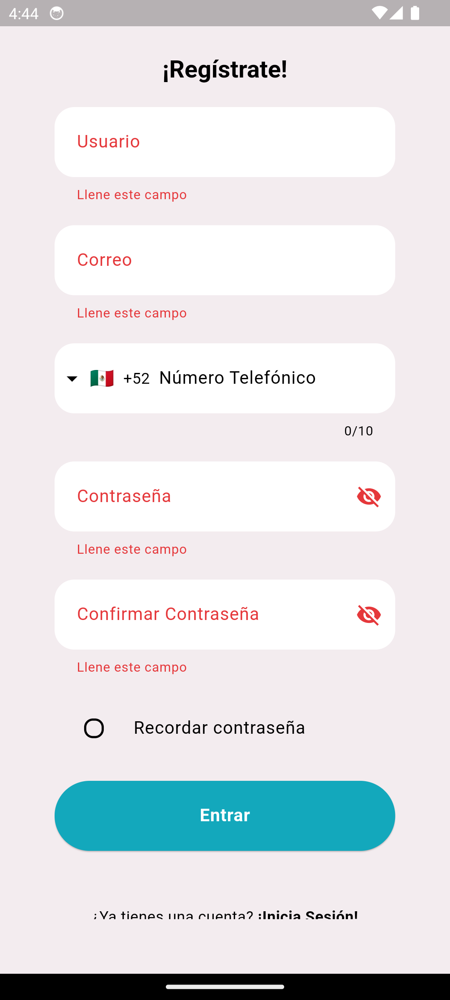

# SignUp-Frontend Flutter

Una interfaz intuitiva y moderna para registro de usuarios, desarrollada con Flutter. Este proyecto sirve como base para aplicaciones que requieren un flujo de autenticación.

>[!NOTE]
>Este proyecto solo es la interazar de usuario, no tiene funcionalidad de backend implementada. Puedes añadir una API para almacenar y autenticar usuarios.

## Características

- Validación para los campos de entrada:
  - Email: Formato válido de correo electrónico.
  - Contraseña: Reglas personalizables (mínimo de caracteres, símbolos, etc.).
- Tema claro y obsuro.
- Flujo separado para login y registro.
- Fácil integración con APIs.

>[!IMPORTANT]
>¡Todavia esta en desarrollo! NO esta terminado

## Instalación  
1. Clona este repositorio:  

```bash
git clone https://github.com/Manuel-Alonso-AG/SingUp-Frontend.git
```

2. Instala las dependencias:

```bash
flutter pub get
```

3. Ejecuta la app:

```bash
flutter run
```

## Capturas de pantalla

| <center>Pantalla de Acceso</center>  | <center>Pantalla de Registro</center> |
|---------------------|----------------------|
|  |  |
| <center>Datos invalidos</center> | <center>Datos invalidos</center> |
|  |  |

## Agregar funcionalidad
En en la carpeta *lib/pages/*, tanto los archivos llamados *login_page.dart* y *register_page.dart* se encuentra la funcion **submitForm**, se encarga de manejar la acción de inicio de sesión o registro y verifica que el formulario sea válido antes de continuar.

```Dart
void submitForm() {
    if (!formKey.currentState!.validate()) return;

    /* TODO: Implementar la lógica para interactuar con el backend */

}
```

___

>[!IMPORTANT]
>### Licencia  
>Este proyecto está licenciado bajo la Licencia MIT. [LICENSE](./LICENSE).