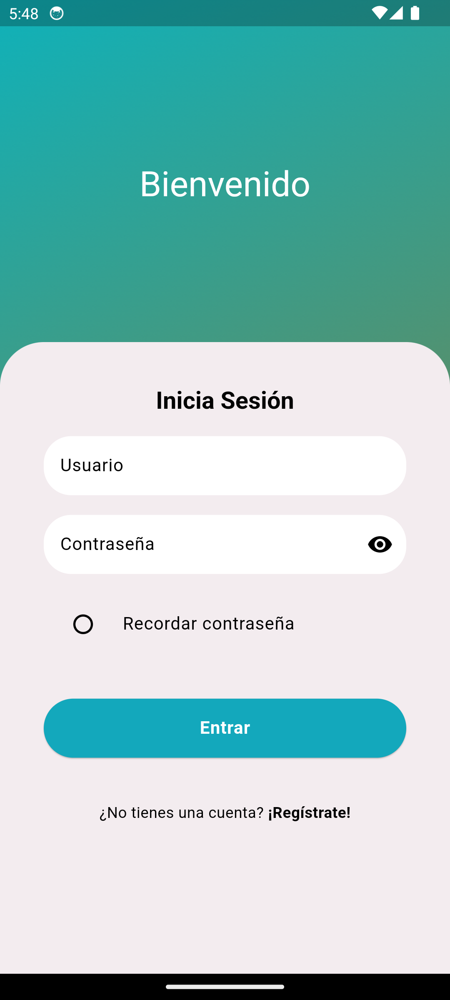
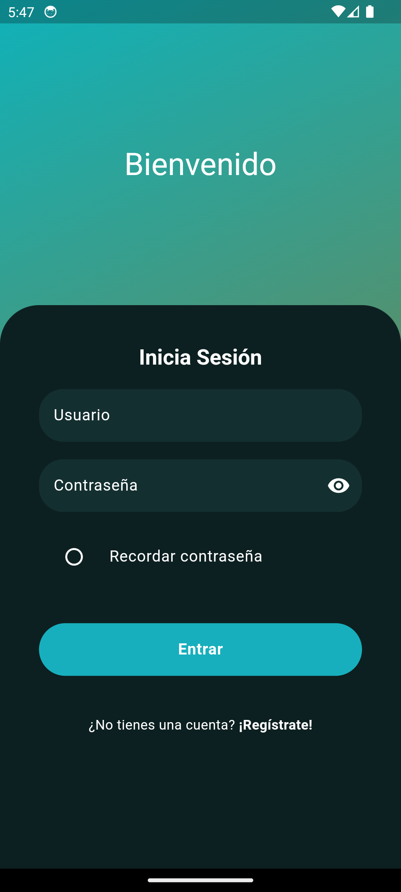
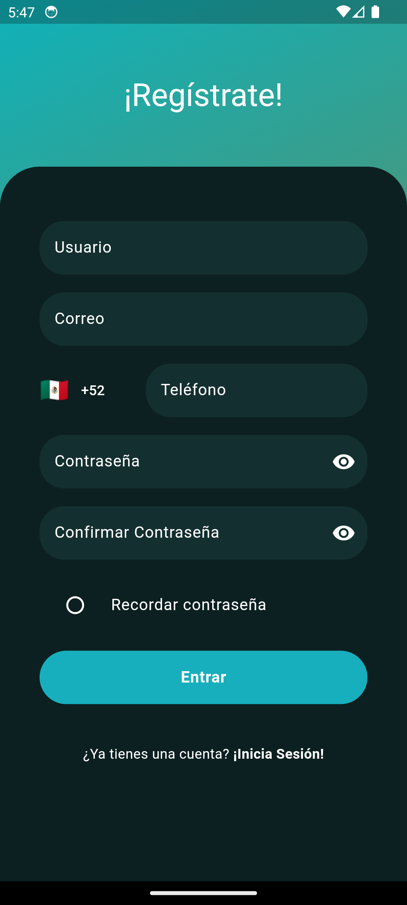

# SignUp-Frontend Flutter


Una interfaz intuitiva y moderna para registro de usuarios, desarrollada con Flutter. Este proyecto sirve como base para aplicaciones que requieren un flujo de autenticación.


>[!NOTE]
>Este proyecto solo es la interfaz de usuario, no tiene funcionalidad de backend implementada. Puedes añadir una API para almacenar y autenticar usuarios.


## Características

- Uso de campos de entrada tal como:
  * Nombre de usuario
  * Correo
  * Telefono
  * Contaseña
- Validación para los campos de entrada:
  * Email: Formato válido de correo electrónico.
  * Contraseña: Reglas personalizables (mínimo de caracteres, símbolos, etc.).
- Tema claro y oscuro.
- Flujo separado para login y registro.
- Fácil integración con APIs.


## Instalación  
1. Clona este repositorio:  


```bash
git clone https://github.com/Manuel-Alonso-AG/SingUp-Frontend.git
```


2. Instala las dependencias:


```bash
flutter pub get
```


3. Ejecuta la app:


```bash
flutter run
```


## Capturas de pantalla


| <center>Pantalla de Acceso</center>  | <center>Pantalla de Registro</center> |
|---------------------|----------------------|
|  |  |
| <center>Modo oscuro</center> | <center>Modo oscuro</center> |
|  |  |


## Cambiar apariencia


### 1. Theme ( Colores para claro y oscuro)
- En la carpeta de *lib/theme/* se encuentran los archivos de:
  * **theme.dart** los colores principales para la apariencia de la app


  ```Dart
  ThemeData lightTheme = ThemeData(
    // ... //
    // TODO: Colores usados para colores claros
    colorScheme: const ColorScheme.light().copyWith(
      primary: const Color(0xFF0FB2BA),
      inversePrimary: const Color(0xFF53916F),
      // ... //
      error: const Color(0xFFe5383b),
    )
  );


  ThemeData darkTheme = ThemeData(
    // ... //
    // TODO: Colores usados para colores obscuros
    colorScheme: const ColorScheme.dark().copyWith(
      primary: const Color(0xFF0FB2BA),
      inversePrimary: const Color(0xFF53916F),
      // ... //
      error: const Color(0xFFFB244F),
    )  
  );
  ```


### 2. Valores de los elementos
- Cada elemento o componente tiene valores para el padding o margin, borde, estilo de texto, etc...<br> Si deseas cambiar estos valores, puedes acceder a ellos en la carpeta *lib/utils/* con los archivos con terminación xx_constants.dart:
  * colors_constants.dart
  * radius_constants.dart
  * spacing_constants.dart
  * text_constants.dart


## Agregar funcionalidad


### 1. Implementación del backend:


- En la carpeta *lib/pages/*, tanto en los archivos llamados *login_page.dart* y *register_page.dart* se encuentra la función **submitForm**, que se encarga de manejar la acción de inicio de sesión o registro y verifica que el formulario sea válido antes de continuar.


```Dart
void submitForm() {
  if (formKey.currentState?.validate() ?? false) {
    setState(() => loadingButton = true);
    bool isChecked = checkboxKey.currentState?.isChecked ?? false;
    debugPrint('Checkbox is checked: $isChecked');
    
    // Implementa la logica para interactuar con el backend
    // Ejm: AuthService.login(nameController.text, passController.text);
    
  } else {
    setState(() => loadingButton = false);
  }
}
```


### 2. Implementación de validaciones para los campos:
- Dentro del archivo de *lib/utils/validators.dart* se encuentran las funciones:


  * validatorEmail
  * validatorPass
  * validatorConfirmPass
  * validatorPhone
  * validatorName


- Cada función tiene un apartado para poder agregar cualquier condición que requieras, además de poder modificar o quitar las ya agregadas.


```Dart
String? validatorName(String? value) {
  if (value!.isEmpty) {
    return 'Llene este campo';
  } else if (value.length < 3) {
    return 'Tiene que tener al menos 3 letras';
  } /* else {


    TODO: Agrega la validacion que necesites
 
  }*/


  return null;
}
```


___


>[!IMPORTANT]
>### Licencia  
>Este proyecto está licenciado bajo la Licencia MIT. [LICENSE](./LICENSE).

